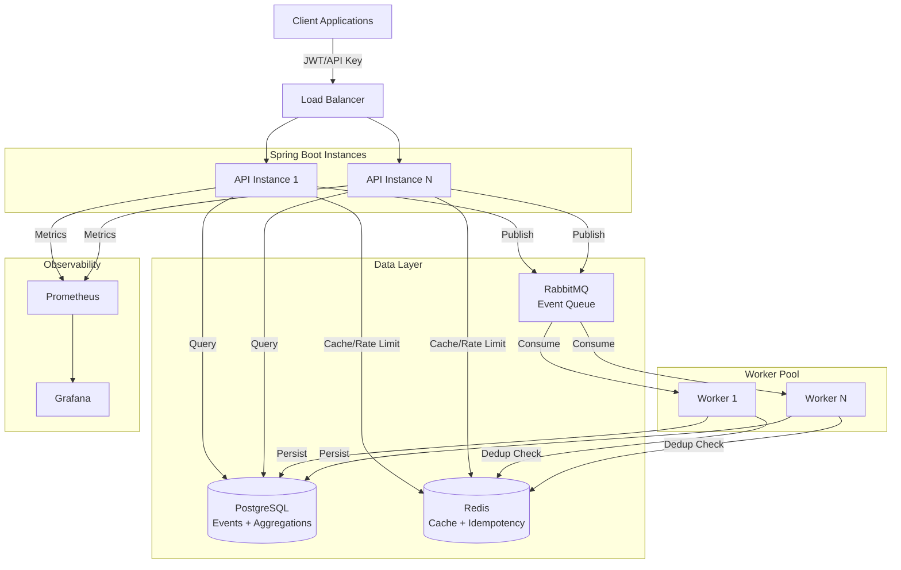
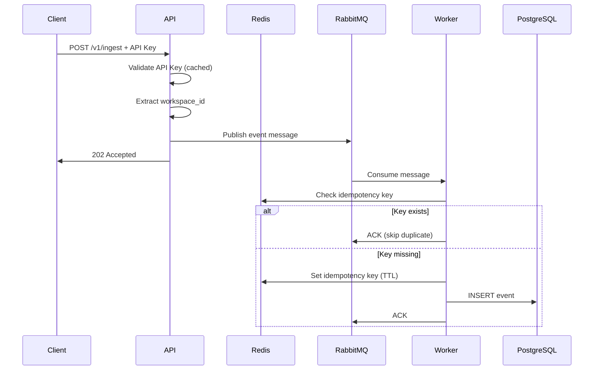
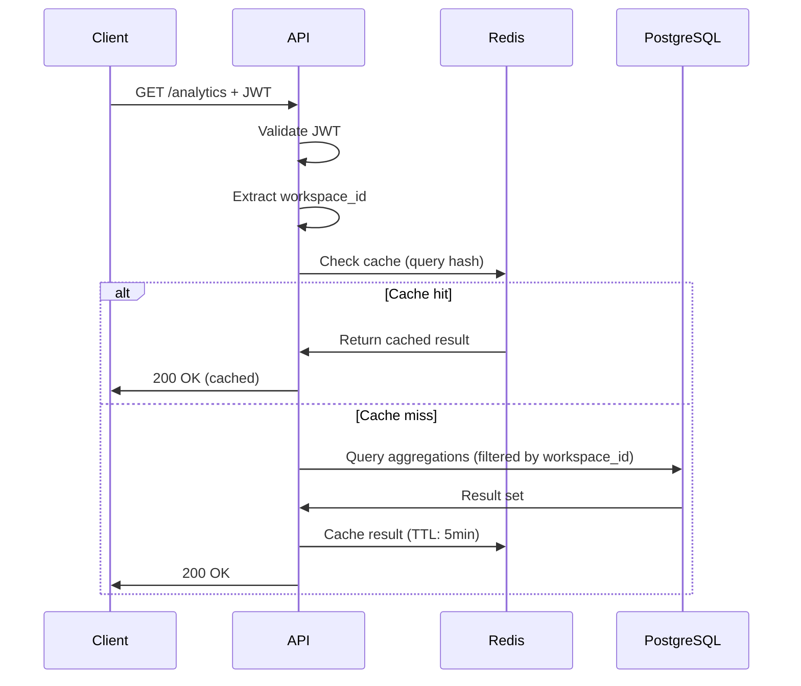
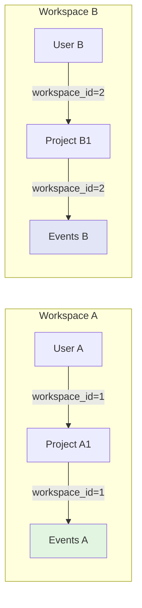
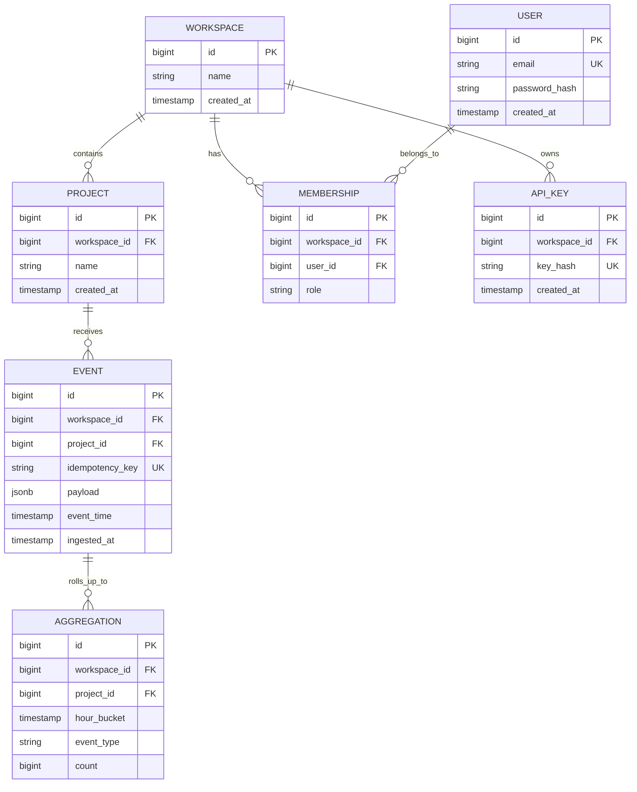
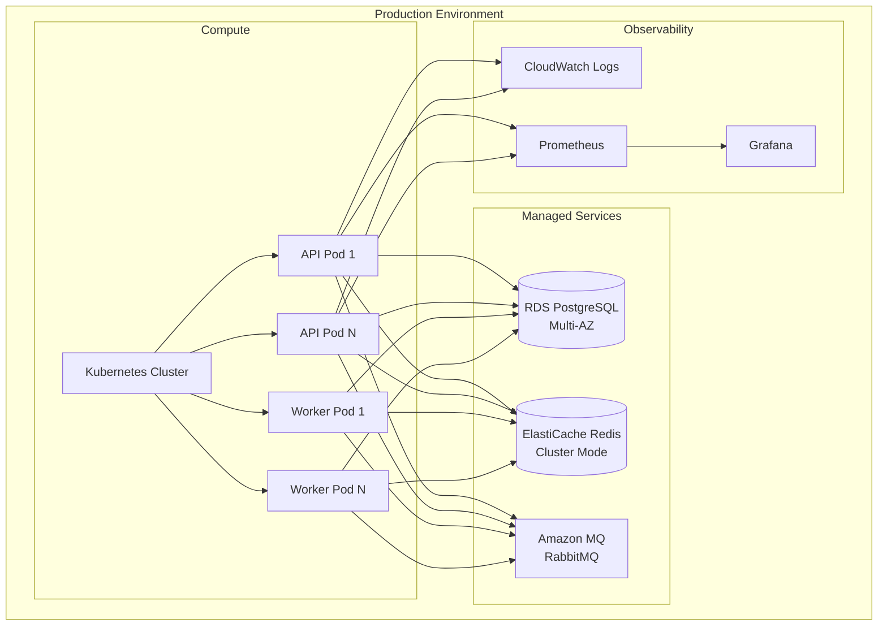

# Architecture Diagram

## System Overview

## Request Flow: Event Ingestion

## Request Flow: Analytics Query

## Multi-Tenancy Isolation

**Enforcement:**
- All queries filtered by `workspace_id` at repository layer
- JWT/API Key contains workspace context
- Database indexes include `workspace_id` as first column

## Data Model

## Deployment Architecture

## Scaling Strategy

| Component | Scaling Method | Trigger | Max Capacity |
|-----------|---------------|---------|--------------|
| API Pods | Horizontal (HPA) | CPU > 70% or RPS > 1000 | 10 pods |
| Worker Pods | Horizontal (HPA) | Queue depth > 1000 | 20 pods |
| PostgreSQL | Vertical + Read Replicas | CPU > 80% | 3 replicas |
| Redis | Cluster Mode | Memory > 80% | 6 shards |
| RabbitMQ | Cluster | Queue depth > 10000 | 3 nodes |
