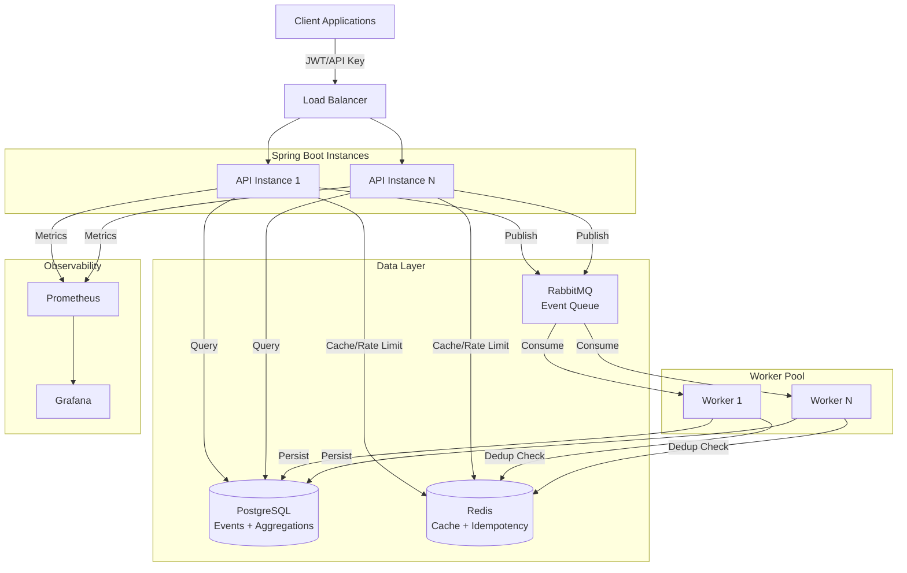
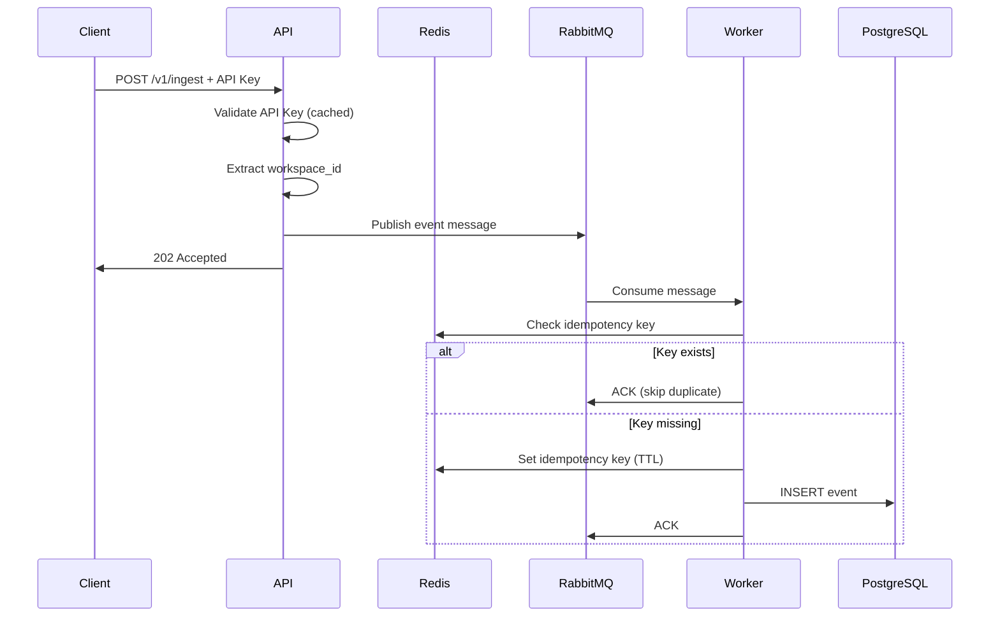
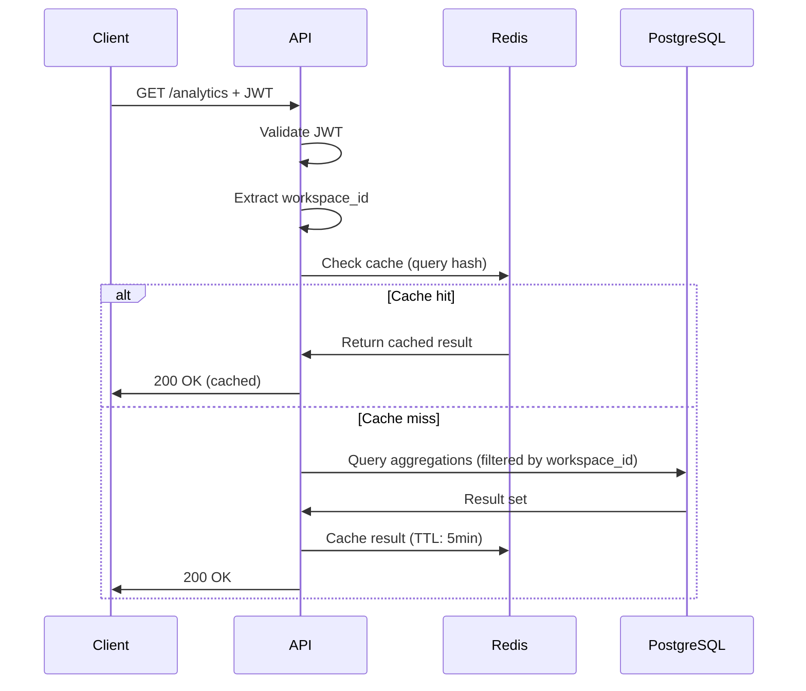
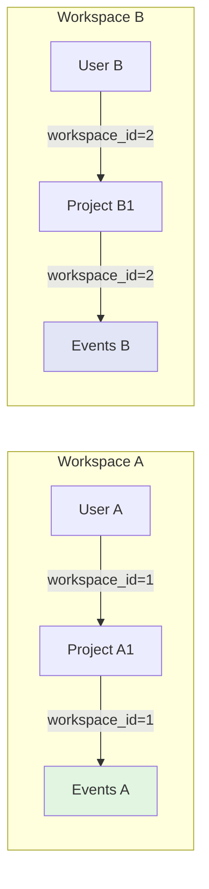
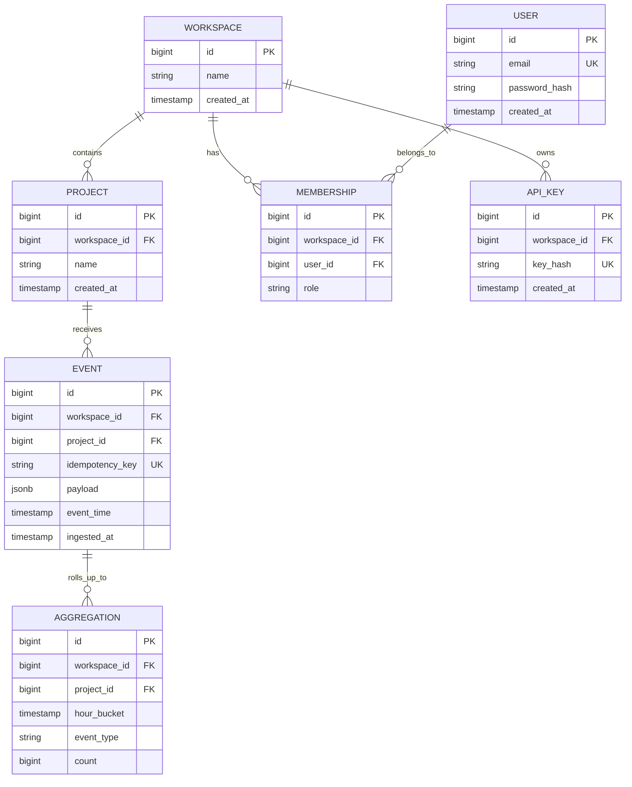
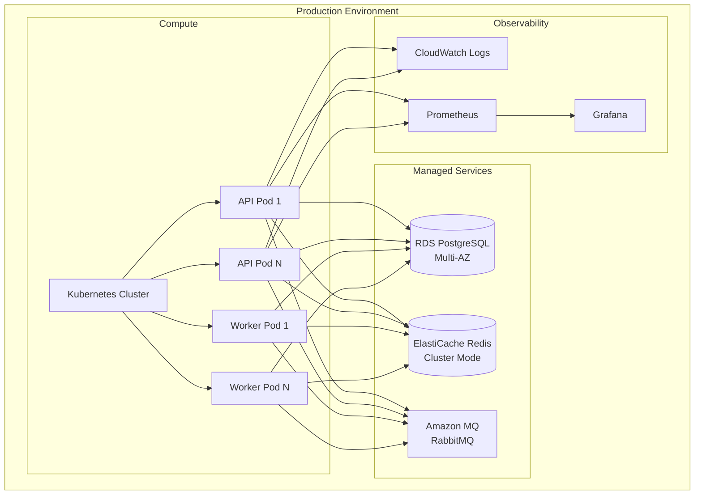

# Architecture

## Problem Statement

**Challenge:** Build a multi-tenant event ingestion platform that handles high write volume (target: 50k events/min) with strict tenant isolation and sub-100ms query latency.

**Non-Functional Requirements:**
- **Throughput:** 1000 events/sec sustained, 2000 events/sec burst
- **Latency:** P99 < 100ms for ingestion, P99 < 50ms for analytics queries
- **Availability:** 99.9% uptime (43 min downtime/month)
- **Isolation:** Zero cross-tenant data leakage
- **Idempotency:** Duplicate events rejected (client retries safe)

**Constraints:**
- Small team (1-2 engineers) → operational simplicity matters
- Budget-conscious → avoid over-engineering
- Rapid iteration → Docker Compose before Kubernetes

---

## System Overview



---

## Design Decisions

### Why RabbitMQ over Kafka?
**Decision:** RabbitMQ for async event processing

**Rationale:**
- **Simpler operations:** No ZooKeeper, easier local dev with Docker Compose
- **Sufficient throughput:** Handles 10k msg/sec (our target: 2k/sec)
- **Manual acknowledgment:** Explicit control over message processing (no data loss)
- **Mature Spring integration:** Spring AMQP provides robust abstractions

**Trade-off:** Lower max throughput than Kafka (~10k vs 100k msg/sec), but operational simplicity wins at current scale.

**When to revisit:** If sustained load exceeds 5k events/sec or need log compaction.

---

### Why Redis for Idempotency?
**Decision:** Redis for deduplication checks before PostgreSQL

**Rationale:**
- **Speed:** Sub-millisecond lookups vs 50ms DB query (100x faster)
- **TTL support:** Auto-expire keys after 1 hour (no cleanup job needed)
- **Atomic operations:** `SET NX EX` prevents race conditions
- **Defense in depth:** DB unique constraint catches duplicates if Redis fails

**Trade-off:** Redis failure → fall through to DB (slower but functional). Acceptable because correctness guaranteed by DB constraint.

**When to revisit:** If Redis becomes single point of failure (solution: Redis Sentinel).

---

### Why Pre-Computed Aggregations?
**Decision:** Hourly rollup table instead of real-time aggregation

**Problem:** Full table scan on 10M events = 5s query time (unacceptable)

**Solution:** 
- Scheduled job aggregates events into `event_aggregations` table
- Query scans 720 rows/month instead of millions
- Result: 5s → 50ms (100x improvement)

**Trade-off:**
- **Storage cost:** 2x data (raw + aggregated)
- **Granularity:** Hourly buckets (not minute-level)
- **Freshness:** Up to 1 hour delay for latest data

**When to revisit:** If real-time analytics required (solution: Kafka + ksqlDB streaming aggregations).

---

### Why Async Ingestion?
**Decision:** Return 202 Accepted immediately, process via queue

**Rationale:**
- **Decouples write path:** API doesn't wait for DB commit
- **Handles traffic spikes:** Queue absorbs bursts (up to 10k messages)
- **Graceful degradation:** If DB slow, API stays responsive

**Trade-off:** Eventual consistency (1-2 second delay from ingestion to persistence).

**When to revisit:** If clients require synchronous confirmation (rare for analytics use case).

---

## Request Flows

### Event Ingestion



### Analytics Query



## Multi-Tenancy Isolation



**Enforcement:**
- All queries filtered by `workspace_id` at repository layer
- JWT/API Key contains workspace context
- Database indexes include `workspace_id` as first column

---

## Data Model



---

## Failure Analysis

### What Fails First?
**Answer:** PostgreSQL writes at ~2000 events/sec

**Evidence:**
- Single-threaded writes (even with connection pool)
- Disk I/O becomes bottleneck
- HikariCP max pool size (10) limits concurrent writes

**Solutions (in order of complexity):**
1. **Batch inserts** (20 events/txn) → 5x throughput improvement
2. **Read replicas** for analytics queries (offload SELECT traffic)
3. **Partition by workspace_id** (horizontal sharding)

**Current implementation:** Batch inserts enabled (`hibernate.jdbc.batch_size: 20`)

---

### Cascading Failure Prevention

**RabbitMQ down:**
- API returns 503 Service Unavailable
- Clients retry with exponential backoff
- Health check fails → load balancer stops routing traffic

**Redis down:**
- Idempotency checks fall through to DB (slower, but functional)
- Cache misses → all queries hit PostgreSQL (degraded performance)
- Rate limiting disabled (fail open to preserve availability)

**PostgreSQL down:**
- Messages queue in RabbitMQ (up to 10k buffered)
- Workers retry with exponential backoff (max 3 attempts)
- Failed messages route to Dead Letter Queue
- API returns 503 after queue full

**Worker crash:**
- RabbitMQ redelivers unacknowledged messages
- Other workers continue processing
- No data loss (manual ACK only after DB commit)

---

## Trade-Offs

| Decision | Benefit | Cost | When to Revisit |
|----------|---------|------|------------------|
| Async ingestion | Handles traffic spikes, decoupled architecture | Eventual consistency (1-2s delay) | If real-time confirmation required |
| Pre-aggregations | Fast queries (50ms vs 5s) | 2x storage, hourly granularity | If minute-level precision needed |
| Manual ACK | No message loss, explicit error handling | Complex retry logic | Never (correctness > simplicity) |
| Single PostgreSQL | Simple operations, ACID guarantees | Write bottleneck at 2k/s | At 5k events/sec sustained |
| Redis caching | 100x faster lookups (2ms vs 200ms) | Cache invalidation complexity | If consistency more critical than speed |
| Docker Compose | Fast local dev, simple deployment | Not production-grade | When traffic exceeds single-host capacity |
| RabbitMQ over Kafka | Simpler ops, sufficient throughput | Lower max throughput (10k vs 100k) | At 5k events/sec or need log compaction |

---

## Deployment

### Current: Docker Compose

**Local Development:**
```bash
docker-compose up -d  # PostgreSQL + Redis + RabbitMQ
./mvnw spring-boot:run
curl http://localhost:8080/actuator/health
```

**Why Docker Compose?**
- Sufficient for 1k req/s (current load)
- Entire stack runs on single machine
- Fast iteration (no K8s complexity)
- Production-like environment locally

**Limitations:**
- Single point of failure (no HA)
- Vertical scaling only
- Manual deployment process

---

### Future: Kubernetes (Not Implemented)

**Production Architecture:**



**Why Not K8s Yet?**
- Docker Compose handles current load (1k req/s)
- Premature optimization adds operational burden
- Small team (1-2 engineers) → simplicity matters
- K8s justified when horizontal scaling required

**Migration Path:**
1. Containerize app (Dockerfile with multi-stage build)
2. Deploy to single EC2 instance (Docker Compose)
3. Add load balancer when traffic grows
4. Migrate to ECS/EKS when multi-host needed

---

## Scaling Strategy

### Component Scaling

| Component | Scaling Method | Trigger | Max Capacity |
|-----------|---------------|---------|--------------|
| API Pods | Horizontal (HPA) | CPU > 70% or RPS > 1000 | 10 pods |
| Worker Pods | Horizontal (HPA) | Queue depth > 1000 | 20 pods |
| PostgreSQL | Vertical + Read Replicas | CPU > 80% | 3 replicas |
| Redis | Cluster Mode | Memory > 80% | 6 shards |
| RabbitMQ | Cluster | Queue depth > 10000 | 3 nodes |

### What Changes at 10x Scale (20k events/sec)?

**Bottleneck:** PostgreSQL writes (current max: 2k/sec with batching)

**Solutions:**
1. **Partition RabbitMQ queues by workspace_id**
   - Parallel processing across workers
   - Reduces contention on single queue
   - Implementation: Consistent hashing on workspace_id

2. **PostgreSQL sharding**
   - Partition `events` table by workspace_id
   - Each shard handles subset of tenants
   - Requires application-level routing

3. **Redis cluster mode**
   - Distribute cache across 6 shards
   - Handles 100k ops/sec (current: 10k)
   - Automatic failover with Sentinel

4. **Read replicas for analytics**
   - Offload SELECT queries to replicas
   - Primary handles writes only
   - Replication lag: 1-2 seconds acceptable

---

## Future Enhancements

### If Real-Time Analytics Required
**Current limitation:** Hourly aggregations (up to 1 hour delay)

**Solution:**
1. **Kafka + ksqlDB** for streaming aggregations
2. **Materialized views** in PostgreSQL (incremental refresh)
3. **WebSocket API** to push updates to clients
4. **Time-series DB** (TimescaleDB) for high-cardinality metrics

**Trade-off:** 10x operational complexity for real-time capability

---

### If Multi-Region Required
**Current limitation:** Single-region deployment (high latency for distant users)

**Solution:**
1. **PostgreSQL cross-region replication** (async, read replicas per region)
2. **RabbitMQ federation** (queue mirroring across regions)
3. **Redis geo-replication** (active-active with conflict resolution)
4. **Global load balancer** (route to nearest region)

**Trade-off:** Eventual consistency across regions, conflict resolution complexity

---

### If Compliance Required (GDPR, SOC2)
**Current gap:** No audit logging, data retention policies, or encryption at rest

**Solution:**
1. **Audit log table** (who accessed what, when)
2. **Data retention policies** (auto-delete events after 90 days)
3. **Encryption at rest** (PostgreSQL TDE, Redis encryption)
4. **Field-level encryption** for sensitive payload data
5. **Right to deletion** (cascade delete by workspace_id)

**Trade-off:** Performance overhead (encryption), storage cost (audit logs)
